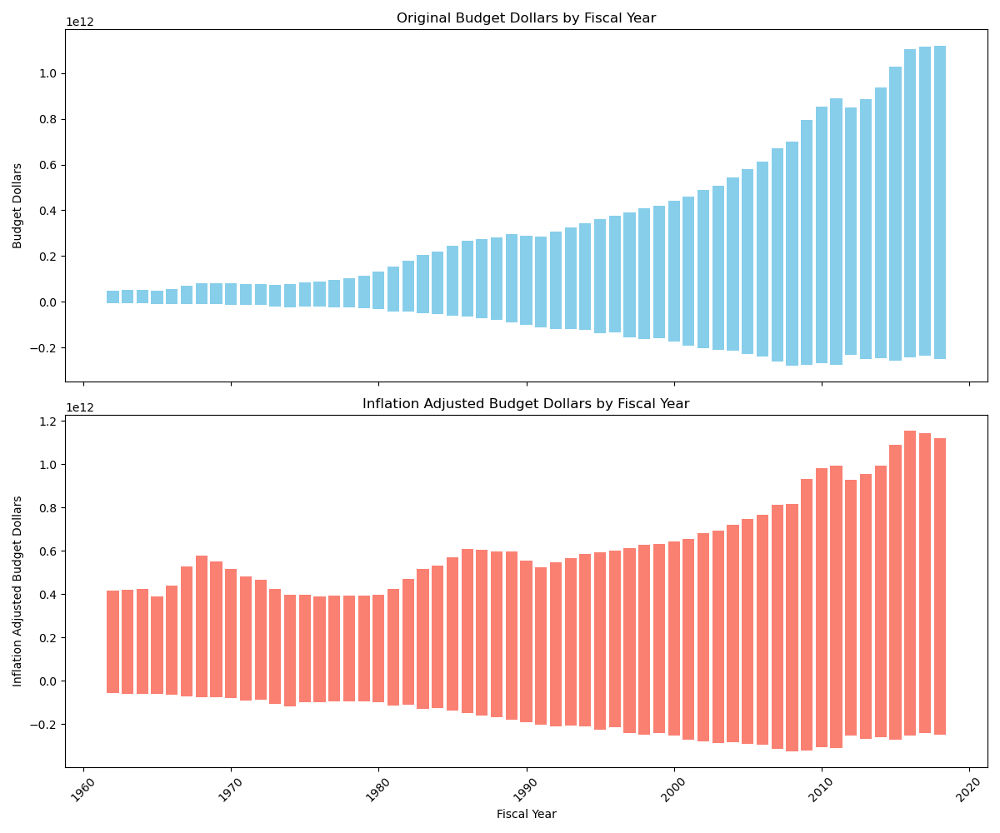
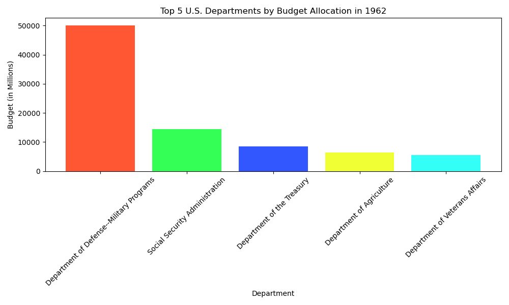
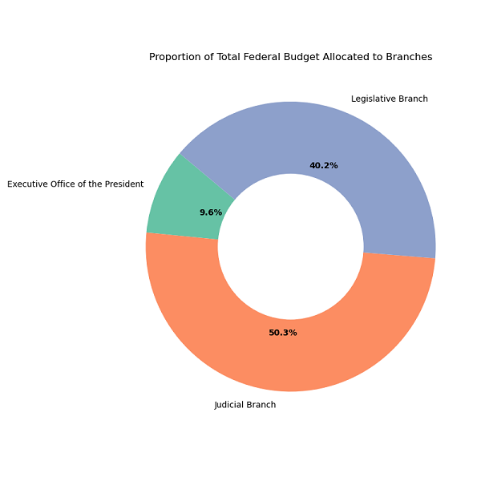
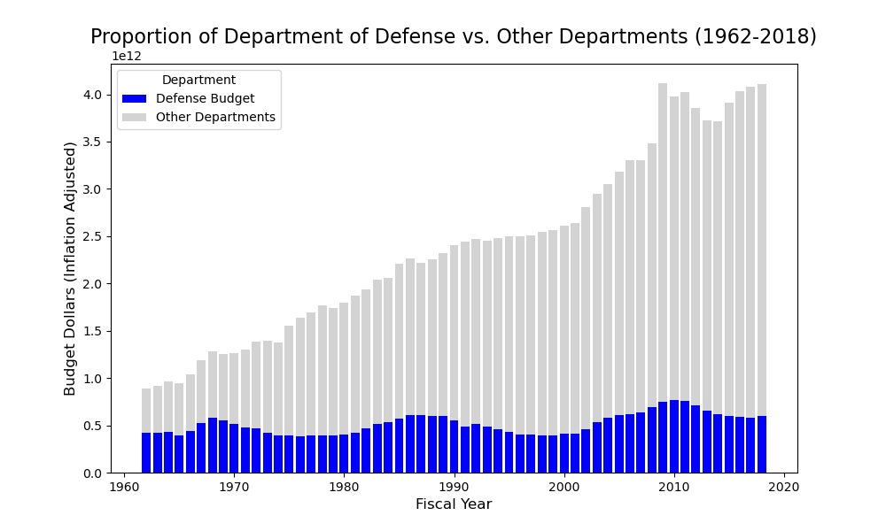
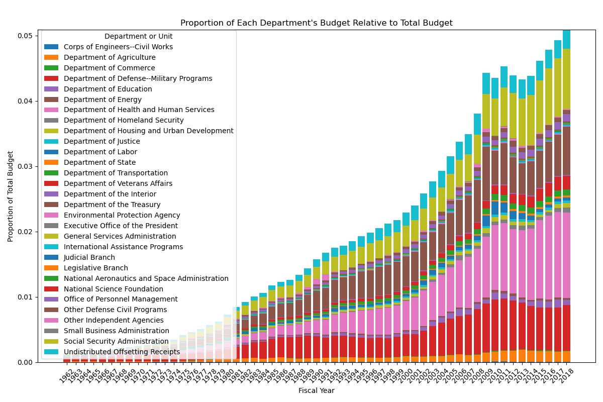
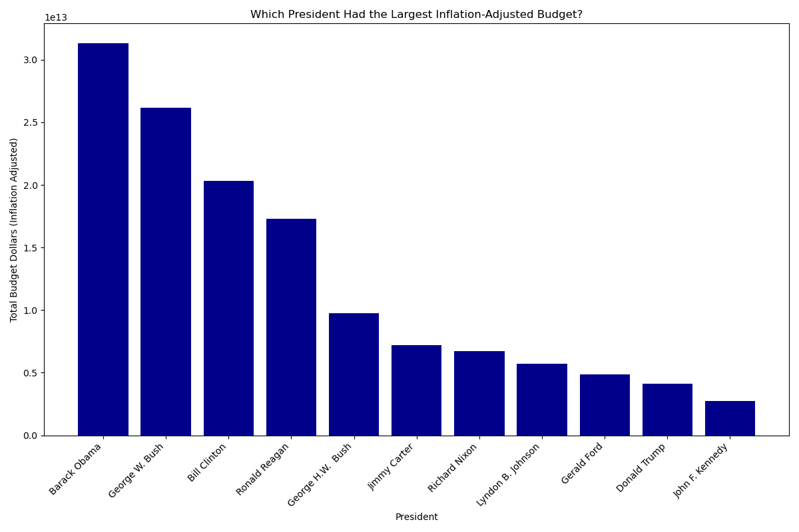
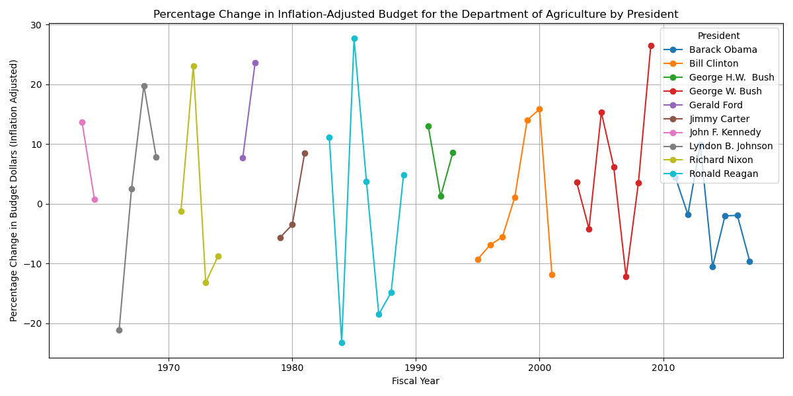

# Python-for-Data-Analysis-US-Budget
This project explors how U.S. federal spending changed from 1962 to 2018. 

[Notebook Link](https://github.com/Kurodataio/Python-for-Data-Analysis-US-Budget/blob/main/Practical_Activity-US_Budget.ipynb)  


---

## Table of Contents

- [Overview](#overview)  
- [Dataset](#dataset)  
- [Technologies Used](#technologies-used)  
- [Installation](#installation)  
- [Usage](#usage)  
- [Analysis & Visualizations](#analysis--visualizations)  
- [Conclusion](#conclusion)  
- [Credits](#credits)  
- [License](#license)  

---

## Overview

- How has the U.S. federal spending changed from 1962 to 2018?
- How have how priorities shifted over time?

---

## Dataset

- Source of the dataset is **'us_budget.csv'** and sourced from ITOnlinelearning/Datawars
- The dataset has **1710 rows and 6 columns/features**
- The dataset covers the period 1962 to 2018
- Key features/columns are Department, Year, President, Budget in $ and Budget (Inflation Adjusted) in $
- The dataset has been pre-processed already

---

<h2>Technologies Used</h2>

<ul>
  <li><strong>Languages & Libraries:</strong> Python, Pandas, NumPy, Matplotlib</li>
  <li><strong>Tools:</strong> Jupyter Notebook, VS Code, Git, GitHub</li>
</ul>

<p>
  
  
  
  

</p>

<P>
  
    
  
  
</p>
<p>
  

</p>

---

## Installation

Step-by-step instructions to set up the project locally:

```bash

# Clone the repository
git clone https://github.com/Kurodataio/Python-for-Data-Analysis-US-Budget.git

# Navigate to the project folder
cd Python-for-Data-Analysis-US-Budget

# Launch Jupyter Notebook
jupyter notebook


```

## Usage

Instructions for using the project:

1. Open the main notebook (`Practical_Activity-US_Budget`)  
2. Run each cell sequentially to reproduce the analysis  
3. Visualizations and results will be generated automatically  


---

## Analysis & Visualizations 

- The US budget has been increasing from 1962 through to 2018.



- In 1962 under John F. Kennedy, the Department of Defense had the highest budget
- In 2018 under Donald Trump, the Department of Defense still had the highest budget
- Of the top 5 funded departments, the Department of Defense was still the biggest funded in 1962 and 2018.


- Between the Excutive, Legislative and Judicial branches, the judicial has had the biggest share of the federal budget at 50.3%




<!-- 
 -->

The data shows increasing numbers of departments such as Homeland Security contributing to the nominal and inflation adjusted budgets. 


Between 1962 to 2018, Barack Obama, George W. Bush and Bill CLinton had the highest budgets. The caveat is that all three served 2 terms, so it is a cumulative total.


Some departments such as the Department of Agriculture show no long term trends. Increases or decreases in budget are linked to each presidents policy or reaction to events.



---

## Conclusion 

- The data shows that even as the federal budget increases, the Department of Defense has maintained the largest singular departmental funding. This funding has been immune to partisan or elected presidents

- There is a difference between nominal growth vs real growth. Once we adjust for inflation the apparent continual nominal rise chnages. There are slower periods of growth and peaks which ay be attributed to policy actions.

- The data and visuaizations are warnings that using nominal values without adjusting for inflation can be misleading. 

- The data does not give the historical, political and social context that drive it. Deeper insight will require further context and research.

---

## Credits

- **Tutorials / References:** Datawars/ITOnlinelearning.com 
- **Dataset Source:** Datawars/ITOnlinelearning.com 

---

## License

This project is licensed under the [MIT License](https://choosealicense.com/licenses/mit/).  

---
